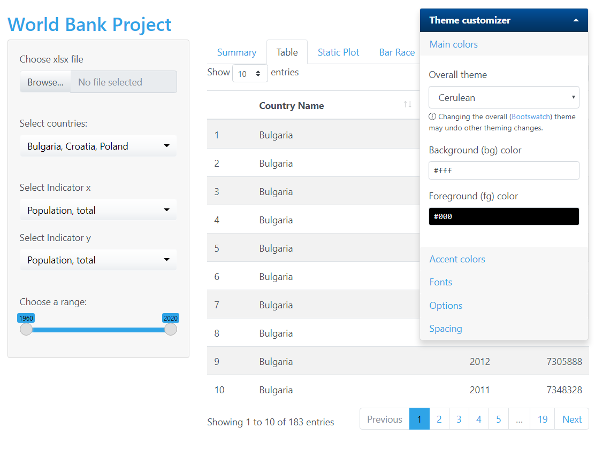
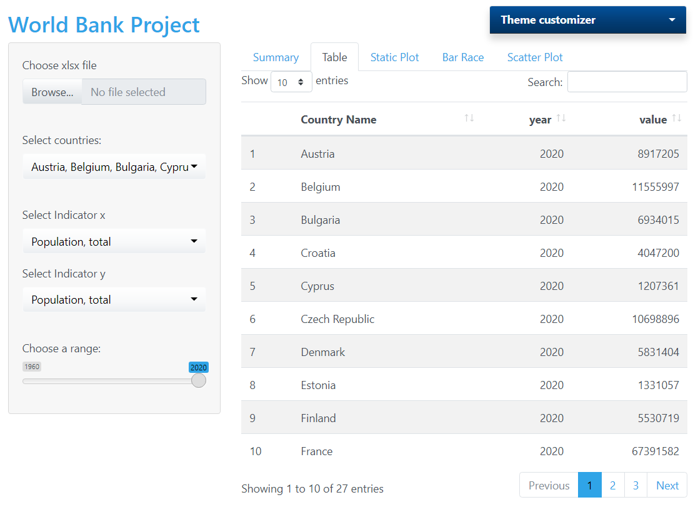
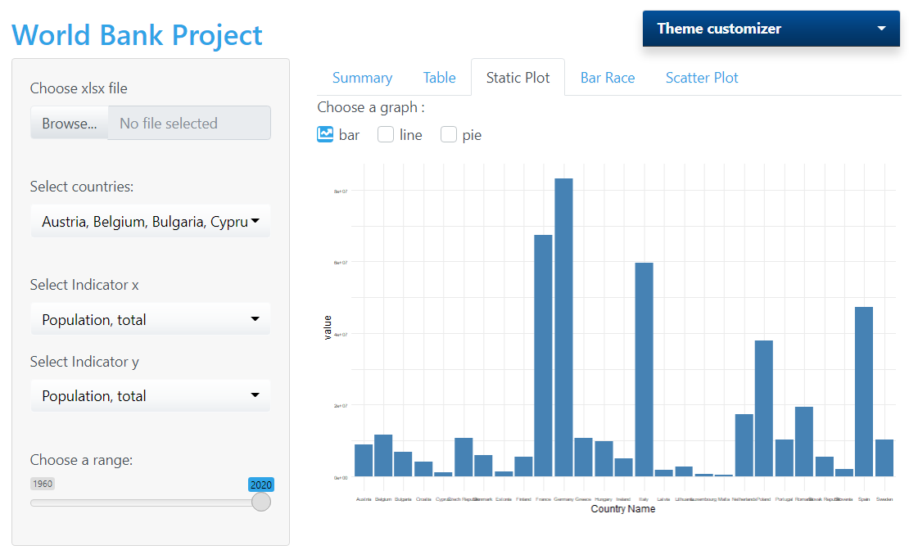
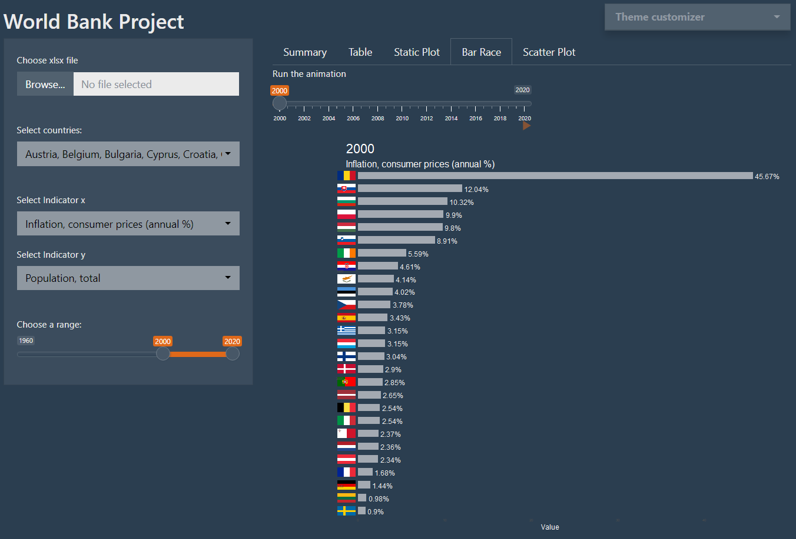
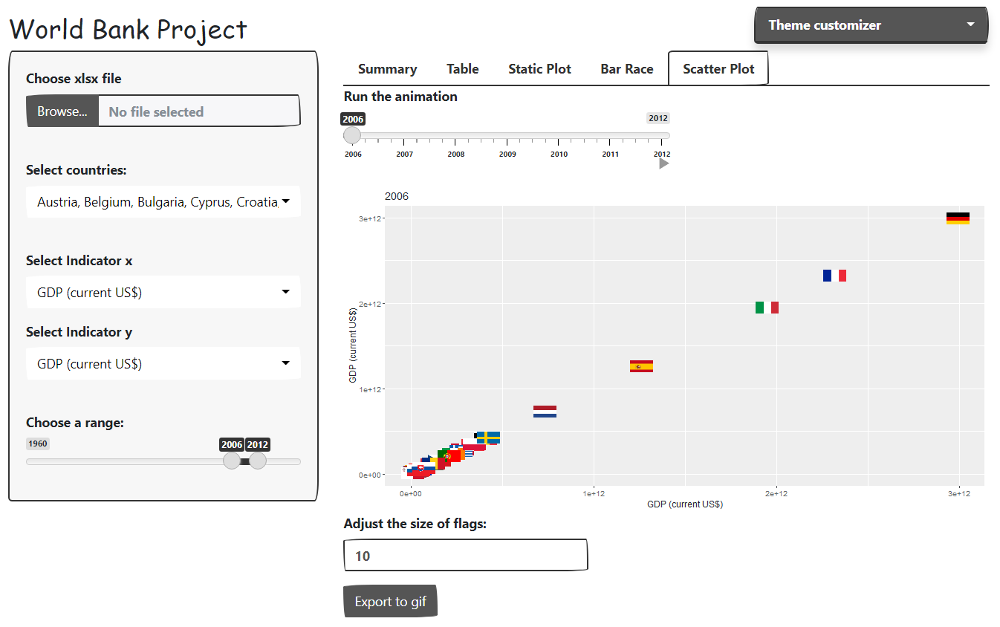

```{r setup, include=FALSE}
knitr::opts_chunk$set(echo = TRUE, message = FALSE, warning = FALSE)
library(devtools)
install_github('https://github.com/ellisp/ggflags')
install_github('https://github.com/kerajxl/WBreader')


packages <- c("ggplot2", "devtools", "gifski", "tidyr", "gganimate", "countrycode", 'shiny', 'shinyWidgets',
              'tidyverse', 'rlang', 'gganimate', 'DT', 'tweenr', 'magick', 'magrittr', 'countrycode',
              'grid', 'ggflags', 'WBreader', 'bslib', 'thematic', 'shinydashboard', 'readxl', 'xtable')


installed_packages <- packages %in% rownames(installed.packages())
if (any(installed_packages == FALSE)) {
  install.packages(packages[!installed_packages])
}

invisible(lapply(packages, library, character.only = TRUE))
#setwd("C:/Users/leski/OneDrive/Pulpit/DS/APR/Advanced_R_project")
options(scipen = 999)
```
## R Package

When downloading data from WorldBank, the default export format is not friendly for quick further use of this data. By default, variables are downloaded in rows, while years are downloaded in column dimensions. This is not a typical database layout, which makes it difficult to further process the information.  
In order to save manual monotonous work for WorldBank users, we started our project by creating a custom R-package for fast transformation of data retrieved from WorldBank.  
The package is called WBReader and is now installable from github: https://github.com/kerajxl/WBreader  
The function included in the package has the following parameters:  

```{r, echo = TRUE, eval = FALSE}
wb_read_excel <- function(path, extension = 'xlsx', keep_NA = FALSE, preview = FALSE,
                          iso_coding = '2c', prettyValue = TRUE) {

...
...
...

  return(df)
}

```
* path: local link to the downloaded file from WorldBank  
* extension: at this stage of development, our package supports the two most popular export formats: xlsx and csv   
* keep_NA - whether the function should keep or remove the null   
* preview - whether the function should display the data after processing   
* iso_coding - WorldBank uses 3 character country encoding while most R packages use 2 character format. Our package solves this problem and gives the user a choice.   
* prettyValue - whether the function should return formatted values (among others, percentage values written as e.g.'89%' instead of '0.89')  

Let's see how our package works in practice. Below the head() function on the loaded original data:  

```{r, echo=TRUE}
data <- read_xlsx('Data_Extract_From_World_Development_Indicators.xlsx')
datatable(head(data[,0:6]))
```

Below is the data after reading it using our package: 

```{r, echo = TRUE}
data <- WBreader::wb_read_excel(path = 'Data_Extract_From_World_Development_Indicators.xlsx')
datatable(head(data))
```

## Application 

### General layout 

Our application is structured in a classic SideBarPanel layout.  
By default, the dataset downloaded by us from Worldbank is uploaded.   
However, on the left side the user can upload his dataset from a local file, which the application will process itself by passing it through our WBReader package.  
The user then selects the countries, indicators, and range of years they want to analyze.   
In the top right corner, the user can expand the panel to customize the theme of the application (background, fonts and many more). 
The right side of the application contains tabs showing different ways to analyze the uploaded data. Several of them are already finished and we will present them further in the presentation.   



### Table View

In this tab, we created an interactive table using the DT package. The user has full control over the view, filtering and moving between pages. 



### Static Plots
In this tab, the user will have a choice of one of three charts:   

* bar plot 
* line plot 
* pie plot 
  
Of course the chart is fully interactive, there is a choice of countries, date range and indicators. 



### Bar Race Animation 
This tab has the ability to generate a bar race type animation.  
It is extremely interesting because it contains simulations of various indicators over time.  
After selecting the countries, indicator, date range and clicking play, an animation will play containing the top 25 countries for the year, which will be represented by flags.  



### Scatter Plot 2D Animation
Scatter plot tab also contains animations.  
This time it shows a two-dimensional scatter plot, where the user can see how the relationships between selected components in selected countries have changed over time.  
The countries are also shown as flags which enhances the visual effect.  
The user can also adjust the size of the flag and export the animation as a gif to a local disk.  



### Interactive game 
Last but not least tab will be an interactive game, in which the player may test her/his knowledge about selected countries :)
We are planning to include questions such as:

* What country is it? (Select 1 country out of 3)
* Which flag represents ...? (Select 1 flag out of 3)
* Which country had the highest GDP per capita in 2007? (Select 1 country out of 3)
* Order these countries by ... (Order flags by dragging them across the screen)

### Final words
Digesting and understanding data is much more pleasant when the data is in nice format. It is even nicer when you explore it with charts and animations, hence the idea for our project. We wanted to create something useful and which pleases the eye. 


